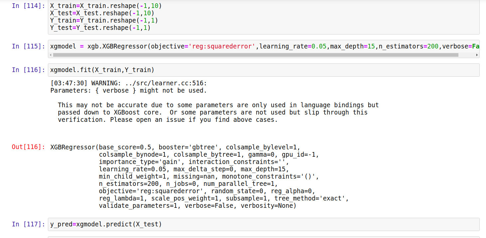
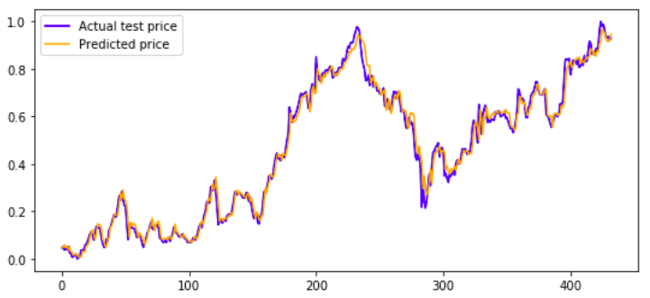
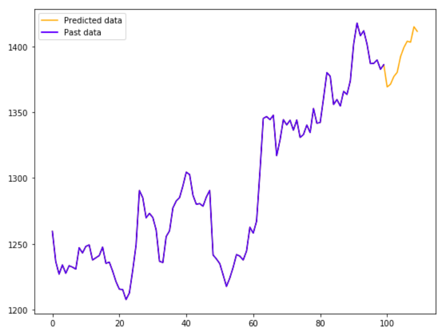
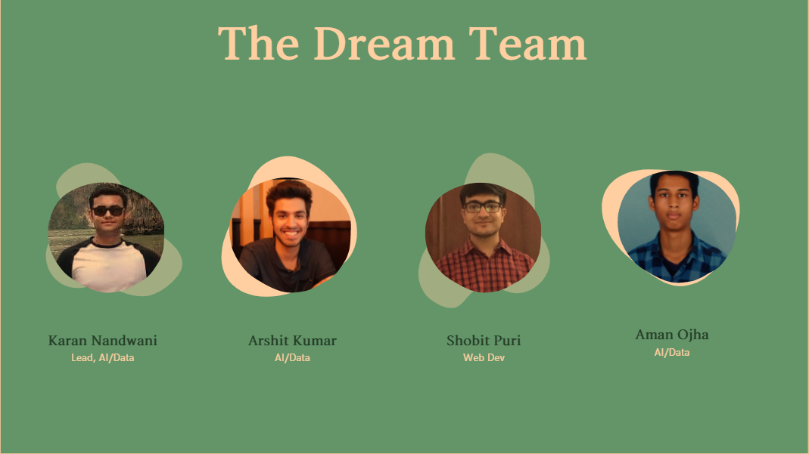

  
  <h1 align= "center">Stonks</h1>

We've all heard it, only those striving to fail tread unknown waters and make no efforts to actually know more about the lay of the land before erecting their home. Is stock investing any different? Be a hero, get to know your stonks and gain the wealth you've only dreamt about!

## Deliverables

* ### [Presentation:](https://www.canva.com/design/DAEIzolMBu0/Aff8n0-juQ1MiF1ZEah5aw/view?utm_content=DAEIzolMBu0&utm_campaign=designshare&utm_medium=link&utm_source=sharebutton) Please follow the link
* ### [Website:](https://stonks-sage.vercel.app/home) Please follow the link

## Solution Highlights  

1. The Presentation Demonstration and GitHub illustrations vividly explain the issues experienced in real-world issues we faced

     The enterprise systems and processes exposed limitations in availability, staffing and hence timely availability of
     results even after testing results were available.

     Gaps in telehealth systems for full auditability / traceability and non-repudiation as more businesses are relying on
     these test results.
  
     Issues around accountability, transparency, speediness, and privacy protected reporting of de-identified , aggregated
     numbers for public health use.
  
     And the realization that re-opening of the economy and wide-spread high scale SAFE testing are 2 sides of the same coin.

 The opportunities to solve these real world problems
    
     - To increase not just patient safety ,but doctor/health worker safety.

     - To have a key tool for safe re-opening of the economy with privacy based minimalistic proof needed for overall safety yet protecting civil liberties.

2.The solution addresses the primary goal of the hackathon to solve the real world problems identified 

     - by leveraging decentralization based technologies including IPFS, the ethereum blockchain to prove existence of key data and metadata across organizations for an audit-ready yet privacy protected designs based on the ethereum stack 

     - by using components already available in the blockchain ecosystem including DID specifications and components, 
     secure distributed file storage systems

3. The solution addresses the gaps in current systems

       - by having key cross-organizational patient data/ meta-data secured for accountability, and cryptographically secured data to quickly send information between parties in the teletext workflow reducing delays

       - allowing whichever parties who are covered entities that have the consented data to report to public health without delays
    
       - de-identifying personal data and also reducing chances of re-identification 

4. The solution entails innovative elements to 

       - incorporate standards like FHIR in to the solution for the business objects

       - use Zero Knowledge proof designs and to design the arithmetic circuits to find if the user has been tested, and the status of their test results to the checker archetype in a minimalistic proof.

## Illustrations

## A look at the code

The image that follows is a look at a snippet of the code behind the model.

The image below shows the accuracy with which our model fits the dataset we train it on. As can be seen, it fits almost perfectly.

What follows is the predicted stock prices for the next 10 days for a certain company.

## A look at the UI

Even though the backend is what makes a product work, what sells it is its presentation. In other words, the frontend.
 
 
 

# Team

 * ### Karan Nandwani 
        
 * ### Arshit Kumar
        
 * ### Shobit Puri 
        
* ### Aman Ojha
        
